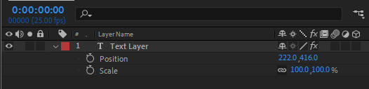

import { Note, Inform, ContentList } from 'components/callout';
import { Successful, Errorful } from 'components/codeOutput';

In the [previous article](/blog/basics-introduction) you learnt that each property expects a value that is of a specific structure, or **type**. In this article you'll learn what those basics types are and what different properties expect.

## Overview

In JavaScript, each value is of a specific type. Which data type a value is defines how you interact with that value in your code.

In the same way, in After Effects the value of each property has a specific type, and your expression needs to return that same type in order to run without errors.

You can see what type a value is by writing `js›typeof value` in an expression (such as the 'Source Text' property of a text layer).

## Number

One of the most common types you will use is `js›Number`, such as `js›8` or `js›12.653`. 

```js
typeof 63;
```
<Successful>

```js
number
```

</Successful>

Numbers allow you to do mathematical operations such as add, subtract, divide and multiply them together, in the same way you're used to on a calculator.

```js
60 + (20 / 2);
```

<Successful>

```js
70
```

</Successful>


### Properties that expect numbers include:

- Opacity
- Slider Controls
- Separated positions (e.g. X Position, Y Position)
- Rotation


## Strings

Strings are pieces of text such as `js›"Jane Doe"` or `js›'After Effects'`.

```js
typeof "Hello!";
```
<Successful>

```js
string
```

</Successful>


Strings must be wrapped in single (`js›''`) or double (`js›""`) quotes so JavaScript knows you're not trying to access a [variable](/blog/basics-variables).

You can create a `js›String` with numbers in it, that isn't of a number type, by wrapping it in quotes, e.g. `js›"12.653"`

```js
typeof "12.653";
```
<Successful>

```js
string
```

</Successful>

### Properties that expect strings:

- Source Text

## Booleans

You can think of Booleans like switches, as they can either have the value `js›true` or `js›false` (notice these are not wrapped in quotes).

```js
typeof true;
```
<Successful>

```js
boolean
```

</Successful>

## Arrays

You'll notice that some properties expect more than one value, such as Position or Scale. You can think of these properties as expecting **a list of values that's a specific length**.

The number of values a property has is called the **dimension** of the property.



For example:

- Scale has 2 values (the X and Y scale) and is a 2 dimensional property
- The position of a 3D layer expects 3 values (the XYZ coordinates) and is a 3 dimensional property
- A color control expects 4 values (the red, green, blue and alpha values) and is a 4 dimensional property

In JavaScript, we can create lists with what's called an **Array**.

<Inform>

Properties such as Position that have more than one value expect an Array.

</Inform>

You create arrays by enclosing a list of comma seperated values in brackets, for example:

```js
["Item 1", "Item 2", "Item 3"];
```

Which is a 3 dimensional `js›Array`  (as it contains 3 items) of 3 `js›Strings`.

To set the value of a 2D position property (which has 2 dimensions), you would create an Array of 2 number values.

```js
[960, 540];
```

### Properties that expect arrays include:

- Position (with un-seperated dimensions)
- Scale
- Anchor Position
- Color Controls

### Array Data Type

Strictly speaking, Arrays aren't a data type, but we've included them here for simplicities sake. There's also more data types than in this article that we'll explore later in the series.

## Type Coercion

You'll notice that while a Source Text property displays text, and expects a string, placing a Number or Array in the expression still works.

```js
[960, 540];
```
<Successful>

```js
960, 540
```

</Successful>

This is due to something called **type coercion**. When you provide a data type different to what is expected, JavaScript will do it's best to convert it to the expected type.

For example, giving a 1 dimensional Array instead of a number on an Opacity property:

```js
[50];
```
<Successful>

```js
50
```

</Successful>

You can convert a value from one data type to another yourself by using the name of the type followed by parenthesis. For example `js›String(54)` or `js›Number([80])`.

```js
typeof(String(54));
```
<Successful>

```js
string
```

</Successful>

Often it's best to do this type conversion yourself rather than relying on coercion.