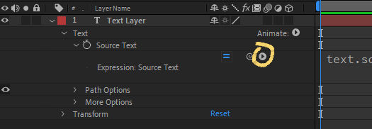

import LocalVideo from 'components/localVideo';
import { Note, Inform, Warn, ContentList } from 'components/callout';
import { Successful, Errorful } from 'components/codeOutput';

In the [Referencing Layers and Compositions](/blog/basics-referance-layers) article you learnt how to create references to After Effects compositions and layers in your expressions, as well as their attributes such as their `js›position`, `js›opacity`, and `js›scale`.

You also learnt, from the previous article about [objects](/blog/basics-objects), that compositions and layers are JavaScript objects, with the layer attributes being properties of those objects.

These [objects](/blog/basics-objects) also have other properties you can access in expressions, which you're unable able to pick whip to as they don't appear in the timeline.

<Inform>

**Native attributes** are the properties on After Effect's built in objects, such as compositions and layers.

</Inform>

In this article you'll learn how to find and use these **native attributes** built into After Effects.

## Finding and using attributes

### The expression language menu

The easiest way to find what attributes are available is via the **expression language menu**, which is the small arrow next to the pick whip on an property with an expression.



Clicking on the arrow reveals the [objects](/blog/basics-objects) available, with their attributes listed as the items in each sub menu. Selecting one of the attributes will insert it into the expression.

<Inform>

The **expression language menu** is a way of seeing the native attributes available, and inserting them into your expression.

</Inform>

Below is an example of using the expression language menu to insert a reference to the composition duration (`js›duration`) which you can find under the "Comp" sub menu.

<LocalVideo videoName="inserting-a-native-attribute" title="Inserting a reference to the composition duration using the expression language menu"/>

As you can see, inserting the duration property alone results in an error:

```js
duration
```

<Errorful>

```js
Reference Error: duration is not defined
```

</Errorful>

This is because `js›duration` is a property of a composition [object](/blog/basics-objects), which you can tell as it's found under the "Comp" menu.

As you learnt in the previous article, **property references must always begin with their parent object**.

Changing the expression to reference the duration of the current composition object (`js›thisComp`) solves the error, and returns the correct duration.

```js
thisComp.duration;
```

<Successful>

```js
180
```

</Successful>

You can known which object to reference by it's location in the expression language menu, whether it's an attribute of a composition, layer or property. For example, `js›speed` is an attribute of Properties as it's found under the "Property" menu.

<Note>

To learn more about how to reference layers and compositions, see [Referencing Layers and Compositions](/blog/basics-referance-layers).

</Note>


### The expression language reference

You can also find a list of most of the native attributes available on Adobe's website, as well as explanations on each attribute.

[Expression language reference (Adobe)](https://helpx.adobe.com/au/after-effects/using/expression-language-reference.html)

This page is a vital resource for writing expressions, and is worth reading and keeping bookmarked.

## Layer and property object references

You may have noticed that for attributes of layer and property objects, such as `js›thisLayer.inPoint` and `js›thisProperty.numKeys`, you can omit the object reference without causing an error.

```js
// With object reference
thisLayer.inPoint;

// Without object reference
inPoint;
```

<Successful>

```js
2
```

</Successful>

This seems to contradict what you learnt about [objects](/blog/basics-objects): that you must always reference the parent object before the attribute (`js›parentObject.attribute`).

### Expression pre processing

The reason layer and property attributes work without the object reference is that After Effects [pre-processes](/blog/expression-pre-processing/) expressions to add references to the current layer or property object on native attributes.

```js
// Un processed (invalid) expression
inPoint;
numKeys;

// Processed (valid) expression
thisLayer.inPoint;
thisProperty.numKeys;
```

<Inform>

For a more in depth look at expressions pre-processing, see the article: [What happens during expression pre-processing](/blog/expression-pre-processing/)

</Inform>

This pre processing is not done to code in [external `js›.jsx` files](/blog/write-expressions-external-files/), so you must ensure to add the object references yourself in that case.

Whether you add the property references yourself, or let After Effects add them during pre processing, is a matter or preference.

<Note>

For the sake of being explicit about what objects the attributes belong to, we prefer to add object references in my own expressions.

</Note>

## Commonly used attributes

Below is a list of native attributes most commonly used in expressions, grouped by their parent [object](/blog/basics-objects). Knowing when and how to use these attributes is a key part of writing expressions.

### Composition

Attributes on composition [objects](/blog/basics-objects), such as `js›thisComp` or `js›comp("Lower Third`, include:

- `js›name`: The name of the composition
- `js›width`: The width of the composition in pixels
- `js›height`: The height of the composition in pixels
- `js›duration`: The duration of the composition in seconds
- `js›numLayers`: The number of layers in the composition

### Layer

Attributes on layer [objects](/blog/basics-objects), such as `js›thisLayer` or `js›thisComp.layer("Name")`, include:

- `js›index`: The position of the layer in the layer stack
- `js›inPoint`: The start point of the layer in seconds
- `js›outPoint`: The out point of the layer in seconds
- `js›parent`: The layer object of the layers parent
- `js›width`: The width of the layer in pixels
- `js›height`: The height of the layer in pixels

### Property

Attributes on property [objects](/blog/basics-objects), such as `js›thisProperty` or `js›thisLayer.transform.opacity`, include:

- `js›numKeys`: The number of keyframes on the property
- `js›value`: The current value of the property
- `js›velocity`: The current velocity of the property
- `js›speed`: The current speed of the property
- `js›name`: The name of the property (e.g. "Opacity")

## Wrapping up

Native attributes enable you to use properties of layers and compositions in your expression, such as their size and duration. Knowing how to find and use these attributes is a key part of writing expressions.

There are also functions built into these objects, known as **native methods**, which you will learn more about in a future article.
