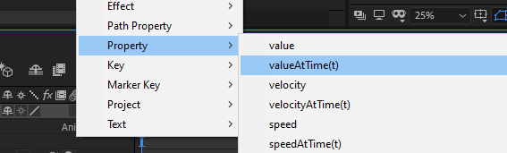
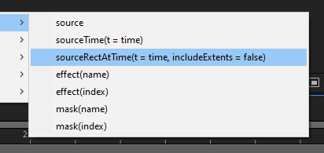

import LocalVideo from 'components/localVideo';
import { Note, Inform, Warn, ContentList } from 'components/callout';
import { Successful, Errorful } from 'components/codeOutput';

In the article on [native attributes](/blog/basics-native-attributes) you learnt how to find and access the attributes built into the After Effects composition, layer and property objects.

As well as attributes, these object have properties which are [functions](/blog/basics-functions).

These built in functions are known as **native methods**.

## Finding and using native methods

The same principles learned in the articles on [functions](/blog/basics-functions) and [native attributes](/blog/basics-native-attributes) apply to native methods.

<Inform>

For an in depth look at how to reference the built in objects, and how functions work, see the previous articles in this series.

</Inform>

You can spot the native methods in the **expression language menu** as they contain parenthesis (`js›()`) after their name, as they are a [functions](/blog/basics-functions), while [native attributes](/blog/basics-native-attributes) do not have parenthesis.

Some methods also have equals signs in the [function](/blog/basics-functions) parameters, which show the **default value** of that parameter.

In the `js›sourceRectAtTime()` method pictured above, the default value for the first parameter is `js›time`, and the second parameter defaults to `js›false`.

## Commonly used methods

Below is a list of native methods most commonly used in expressions, grouped by their parent [object](/blog/basics-objects). Knowing when and how to use these methods is a key part of writing expressions.

<Inform>

For a more detailed explanation for each of these methods, see the [Expression language reference](https://helpx.adobe.com/au/after-effects/using/expression-language-reference.html) by Adobe.

</Inform>

### Composition

Methods on composition [objects](/blog/basics-objects), such as `js›thisComp` or `js›comp("Lower Third`, include:

- `js›layer(index || name)`: Returns the relevant layer object
- `js›marker.key(index || name)`: Returns the relevant marker object

### Layer

Methods on layer [objects](/blog/basics-objects), such as `js›thisLayer` or `js›thisComp.layer("Name")`, include:

- `js›add(vectorA, vectorB)`: Adds two vector arrays
- `js›mul(vector, amount)`: Multiplies every dimension of a vector by the amount 
- `js›clamp(value, limitA, limitB)`: Constrains a value between the provided limits
- `js›random()`: Returns a random number between zero and one

### Property

Methods on property [objects](/blog/basics-objects), such as `js›thisProperty` or `js›thisLayer.transform.opacity`, include:

- `js›valueAtTime(time)`: Returns the value of the property at the input time
- `js›smooth()`: Applies a box filter to smooth the value of the property over time
- `js›nearestKey(time)`: Returns the key object nearest in time to the input

## Wrapping up

Native methods are one of main building blocks of expressions, allowing you to perform complex tasks with minimal code.

Knowing how [functions](/blog/basics-functions) and [native attributes](/blog/basics-native-attributes) work gives you further insight into how best to use native methods in your own expressions.