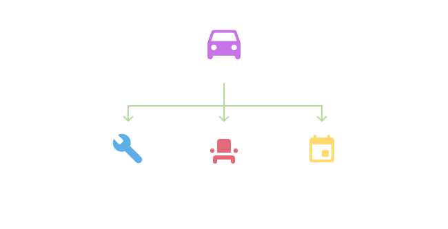

[mdn referance]: https://developer.mozilla.org/en-US/docs/Learn/JavaScript/Objects/Basics

import LocalVideo from 'components/localVideo';
import { Note, Inform, Warn, ContentList } from 'components/callout';
import { Successful, Errorful } from 'components/codeOutput';

In the [Intro to Data Types](/blog/basics-intro-to-data-types) article you learned about some of the most common types of data you'll work with in expressions, such as Numbers and Arrays.

There's another data type you will have used in expressions before, without being aware of it. Anytime you use the "dot" syntax (`js›.`), such as when [referencing layers and compositions](/blog/basics-referance-layers), you're working with a **JavaScript Object**.

In this article, you'll learn more in depth about **Objects**, what they are, and how to create and use them in your expressions.

## Objects and their properties

An Object is a collection of related data, stored in a hierarchy.

This idea of a hierarchy in data is the same as the parent-child relationships that the After Effects project tree follows, with compositions belonging to a project, and layers belonging to compositions.

<Note>

For more info on the After Effects project tree, see [Referencing Layers and Compositions](/blog/basics-referance-layers).

</Note>

All sorts of data can follow this same parent-child structure, such as a car and it's attributes (for example it's make and model).



These attributes are unique to the car, and may be different for each vehicle, so you can think of them as *belonging* to this specific car.

When expressing this data in an expression, it makes sense to keep this same hierarchy, with the attributes of the car belonging to the car itself.

You do this by placing the attributes of the car *inside* the car Object.

In JavaScript terms, the car will be the Object, with it's attributes being the **properties** of that Object.

<Inform>

Objects are a way to create a **collection of related data** in code, such as the attributes of a vehicle.

</Inform>

This is the same for an After Effects layer, which has attributes specific to that layer such position and scale. These attributes are **properties** of the layer Object.

## Creating objects

Below is the car example, expressed as a JavaScript Object, where `js›myCar` is the Object, and it's `js›engine`, `js›seats`, and `js›year` are its properties.

```js
// Creating a car object
const myCar = {
  engine: "4G63T",
  seats: 5,
  year: 1984,
};
```

Running `js›typeof` on our car object shows that it has the type `js›object`.

```js
typeof myCar;
```

<Successful>

```js
object
```

</Successful>


Let's take a look at what each different part of this expression means, and how to create your own Objects in expressions.

### Creating the Object

Creating an empty Object without any properties is much like creating any other [variable](/blog/basics-variables), such as an array, with the key difference of using brackets (`js›{}`) to denote that it's an Object.

```js
// Creating an empty object
const myCar = {};
```

These brackets after the equals sign (`js›=`) tell the JavaScript engine that we're creating an Object, and between the brackets will be the properties of that Object.

### Creating an Objects properties

You place each of the properties between the brackets, separating each one with a comma (`js›,`).

```js
// Adding placeholder properties
const myCar = {
  property,
  property,
  property,
};
```
<Note>

Placing each property on a new line helps keep Objects easy to read.

</Note>

Properties follow the structure of what's called a **key/value pair**, each one having a:

- **Key:** What you use to reference that specific property, also thought of as it's name, which is always a string
- **Value:** The value of the property, which can be of any [data type](/blog/basics-intro-to-data-types)

This is similar to [variables](/blog/basics-variables), which have a name (rather than a key) and a value.

<Inform>

Properties are much the same as variables, but attached to an Object.

</Inform>

You create a key value pair by writing the key, followed by a colon (`js›:`), and then it's value.

```js
// The key value pair
const myCar = {
  key: value,
}
```

<Note>

You can also wrap the key in quotes (`js›""` or `js›''`) to use characters, such as spaces or dashes, which aren't allowed in variable names.

</Note>


The value of a property can be any data type, such as a Number, Array, String, or another Object. Anything that you can put on the right hand side of a [variable](/blog/basics-variables) assignment you can put as the value of a property.

Properties that are a [function](/blog/basics-functions) are known as **methods**.

```js
const myObject = {
  aString: "Hello!",
  aNumber: 12,
  anArray: [1920, 1080],
  anObject: {
    anotherKey: "Another Value",
  },
};
```

<Inform>

Properties are **key/value pairs** that can store any data type, including Objects.

</Inform>

The value of a property can also be a [variable](/blog/basics-variables), for example:

```js
// Using a variable as the property value
const currentVersion = 8;
const myObject = {
  version: currentVersion,
}
```


## Accessing object properties

Now that you've learn how to create Object and their properties, let's take a look at how you can access these properties and use them in other parts of your expression.

### Dot notation

Dot notation is the most common way to access the properties of an Object, and is what you are used to already using throughout your expressions.

To get the value of the property, you type the name of the Object, followed by the **key** for that property. For example:

```js
// Accessing an object property
myCar.engine;
```

<Successful>

```js
"4G63T"
```

</Successful>

This is the syntax you use when [referencing layers and compositions](/blog/basics-referance-layers), such as `js›thisLayer.position`, where `js›thisLayer` is the object and `js›position` is the property.


### Bracket notation

You may also need to use a [variable](/blog/basics-variables) as the key for an object, in which case you can use **bracket notation**.

Rather than separating the object and key with a dot (`js›.`) you write the object name, followed by the key, wrapped in brackets (`js›[]`).

The key can either be another variable, or a string. For example:

```js
// Using a string
myCar['engine'];

// Using a variable
const key = 'seats';
myCar[key];
```

This is useful when you want to use a **dynamic key**, where you can change which property you are accessing based on other code in your expression.

## Setting object properties with dot notation

In the same way that you can read an objects properties with dot notation, you can *modify* a property with dot notation.

You do this by writing the property the same as if you were accessing it's value, followed by the equals sign (`js›=`) and the new value.

For example, to change the numbers of seats in our car example you would write:

```js
// Setting a properties value
myCar.seats = 2;
```

### Creating object properties

You can also create new properties on an existing object in the same way, for example:

```js
myCar.colour = 'white';
```

Which will add a new property on the `js›myCar` object with a key of `js›colour` and a value of `js›'white'`.

## Built in objects and properties

You may not be creating Objects in your own expressions often, but having an understanding of how they work means you can be confidant in using the objects built into After Effects.

The built in objects include Compositions and Layers, with their properties known as **native attributes and methods**, such as `js›wiggle()`, `js›time`, and `js›position`.

You'll learn about these native attributes and methods in depth in future posts.