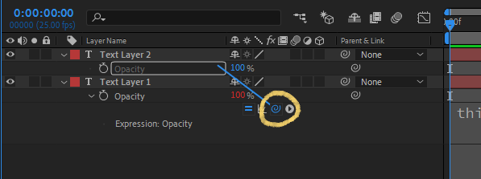
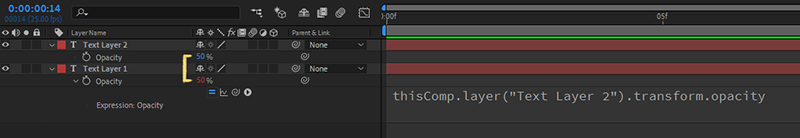
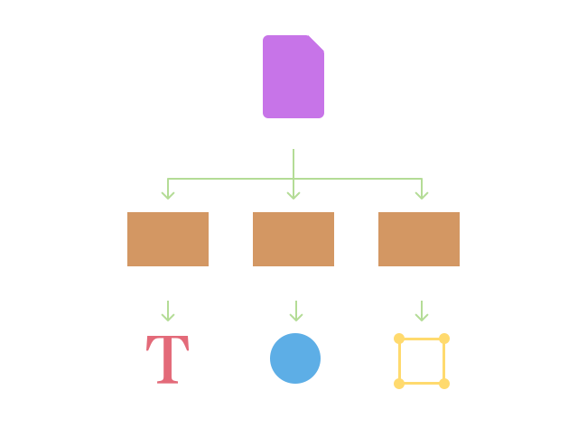
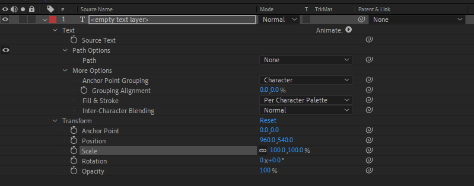

import { Note, Inform, Warn, ContentList } from 'components/callout';
import { Successful, Errorful } from 'components/codeOutput';

In previous article you've learnt how to create and use [variables](/blog/basics-variables) in your expressions. This let you reference pieces of data in your expression using a variable name, for example:

```js
const myVar = 'Hello';
```

Often you need that value to come from a property on a different layer, rather than typing it into the expression directly. This allows you to 'link' layers together, one of the main uses for expressions.

```js
const myVar = 'some value on another layer?';
```

In this article you'll learn how to access properties on other layers in expressions, as well as layers in other compositions.

<ContentList>

- [Using the Pick Whip](#using-the-pick-whip)
- [Referencing Layers](#referencing-layers)
- [Referencing Compositions](#referencing-compositions)
- [Referencing Attributes](referencing-attributes)

</ContentList>

## Using the Pick Whip

One way to add a reference to a property on another layer is by using the **pick whip**.

This will let you select a property to reference using the After Effects interface, adding code to your expression that references the property.



<Inform>

The pick whip is a visual way of adding references to other properties in an expression.

</Inform>

In the above example we've used the pick whip to 'link' the opacity of two text layers by:

1. Adding an expression to the opacity of 'Text Layer 1'
2. Dragging from the pick whip icon (the swirl) to the property we wish to reference.

After Effects then inserted the following code into the expression on `js›'Text Layer 1'`:

```js
thisComp.layer("Text Layer 2").transform.opacity
```

If you then change the Opacity of `js›'Text Layer 1'` you can see the Opacity of `js›'Text Layer 2'` update to match.



In the rest of this article, you'll learn how this expression works as well as how to write it yourself.

## The After Effects Project Tree

Every After Effects project follows the same basic structure:

1. A project file (`js›.aep`)
2. Containing compositions
3. With layers inside those compositions.

You can think of this structure as a tree diagram, where the project is the 'root' of the tree, containing 'child' compositions, and each composition containing 'child' layers in the same way.



<Inform>

An After Effects project can be thought of as a tree of compositions and their layers.

</Inform>

This parent-child relationship of compositions and layers is fundamental to how you use expressions to reference them.

## Referencing Compositions

Before you can reference a layer in an expression, you must tell After Effects which composition to look for that layer in.

Like any other piece of data (such as a number or string) you can store a reference to a comp in a [variable](/blog/basics-variables). For example, to store a reference to the `js›'Lower Third'` composition in the diagram above you would write:

```js
const lowerThirdComp = comp("Lower Third");
```
<Successful>

```js
[object Comp]
```

</Successful>

This line of code tells After Effects to find the composition named `js›'Lower Third'`, and gives you back a reference to this composition (displayed as `js›[Object Comp]` on a text layer).

<Note>

`js›comp()` is one of the functions built into After Effects. You'll learn more about functions, including others built into After Effects, in a future article.

</Note>

Each composition has built in properties, such as `js›name`, which returns the name of the composition. We can use this to make sure we've selected the correct composition in our project.

```js{2}
const lowerThirdComp = comp("Lower Third");
lowerThirdComp.name;
```

<Successful>

```js
"Lower Third"
```

</Successful>

### Accessing the Current Composition

After Effects also provides a variable that is always equal to the current composition (the composition the expression is in).

```js
const currentComp = thisComp;
```

<Inform>

`js›thisComp` will always reference the composition the expression is in.

</Inform>

For example, the expression:

```js
thisComp.name;
```

<Successful>

```js
"Lower Third"
```

</Successful>

Will always return the name of the current composition.

## Referencing Layers

Now you know how to reference a composition in an expression, you can use that composition [object](/blog/basics-objects) to select a specific layer.

Since layers are *contained* within compositions, you must begin by referencing the composition and then the layer. For example:

```js{2}
const lowerThirdComp = comp("Lower Third");
const nameLayer = lowerThirdComp.layer("Name");
```

<Successful>

```js
"Name"
```

</Successful>


<Inform>

In the same way that `js›comp()` is a built in [function](/blog/basics-functions) for referencing compositions, `js›layer()` is a built in function for referencing layers.

</Inform>

Unlike the `js›comp()` function which returns `js›[object Comp]` by default, the `js›layer()` function returns the layers name by default.

### Layer Name or Index

In the above example, we've selected the layer by its name, `js›"Name"`. In some cases you may not know the name of a layer, or you may want to reference it by it's **position in the layer order** rather than it's name. For example, referencing the layer below the layer the expression is on.

You can do this by using the **layer index** in the expression rather than the layer name. For example:

```js
const layerTwo= thisComp.layer(2);
```

Will select the second layer in the composition.

<Inform>

The `js›layer()` function can either take the layer name (e.g. `js›"Text Layer"`) or the layer index (e.g. `js›2`) as it's input.

</Inform>

Using this in conjunction with the built in `js›index` property (which is the index of the layer the expression is on) you can select layers relative to the current layer.

```js
const layerBelow = thisComp.layer(index + 1);
```


### Referencing the Current Layer

In the same way that you can use the `js›thisComp` variable to get a reference to the current composition, there's also a `js›thisLayer` variable that will always reference the layer the expression is on.

For example:

```js
thisLayer.name
```

<Successful>

```js
"Name"
```

</Successful>

Will always return the name of the layer the expression is on.

## Layer Attributes

Now that you've learnt the first two parts of the expression created by the pick whip (referencing the composition and layer) you can move onto referencing the **layer attributes**, such as position, opacity and scale.

```js
thisComp.layer("Text Layer 2").transform.opacity;
```

### What Layer Attributes Are

Each layer has properties that you can change, which you can see by 'twirling' the layer open in the timeline. Each one of these properties is an *attribute* of that layer.



A layers properties follow a parent-child hierarchy in the same way as compositions and layers. In a text layer (as per the above example) you can see that properties such as scale, position and anchor point are all children of the transform property.

### Referencing Layer Attributes

When referencing the property in an expression, your mirror this parent child relationship by starting with the layer (`js›thisLayer`) followed by the parent of the property, and then the property itself.

```js
thisLayer.transform.opacity;
```

In the above example, transform is the property group (or parent) and opacity is the property.

<Note>

You can learn more about the data types associated with each property in the [Intro to Data Types](/blog/basics-intro-to-data-types) article.

</Note>

### thisProperty and value

In the same way you can reference the current composition and layer by using `js›thisComp` and `js›thisLayer`, you can reference the current property by using `js›thisProperty`. This is useful when you want to modify a keyframed value, such as add another value onto it or multiply it by a slider.

```js
const controlAmount =
  thisLayer.effect("Animation Amount")("Slider").value;

thisProperty * controlAmount;
```

You can also use the commonly used shorthand `js›value`, which as it's name suggests is the *value* of the property rather than the property itself.

```js
value;
```

<Note>

You can learn more about the difference between properties and their values in the [Native Attributes](/blog/basics-native-attributes) post.

</Note>

## Wrapping up

In this article you learnt how to link to other layers properties using the **pickwhip**, as well as what each part of the expression means.

```js
const anotherProperty =
  thisComp.layer("Another Layer").transform.position;
```

