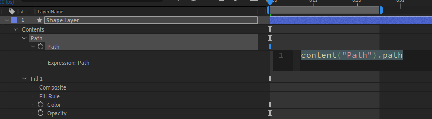

import {
  Note,
  Inform,
  Warn,
  ContentList,
  FileDownload,
} from 'components/callout';
import { Successful, Errorful } from 'components/codeOutput';
import { ToggleSection } from 'components/toggleSection';
import LocalVideo from 'components/localVideo';

After Effects' `js›Rectangle` shape layers are perfect for most tasks, **but when making templates they fall short**.

These shortcomings include:

- Having multiple `js›Position` and `js›Anchor Point` values, on the:

	- `js›Rectangle` path
	- Shape Group
	- Layer Transform properties

- A mix of `Composition`, `Layer` and `Surface` coordinate systems.

- Being unable to swap `js›Anchor Points` when scaling

<Note>

One solution is to use a nested shape group for each corner, or move the anchor point and position with expressions.

</Note>

A common example of these issues is when scaling on a box from the left and off from the right:

<LocalVideo videoName="scale-in-and-out" title="Animating a box by scaling it on from the left anchor point, and out from the right anchor point"/>

<FileDownload fileName="creating-scaling-rectangles-examples" projectName="Download Project File">

You can download the **After Effects project** for the examples in this post:

</FileDownload>

You can get around these issues in a variety of ways, but we've found the best way is to **create a rectangular path in expressions**, rather than relying on the built in `js›Rectangle`.

## What is eBox

eBox is a library that solves these shortcomings, by creating rectangular paths using expressions.

<Inform>

Position, size and scale are all controlled within the one expression, in `js›Composition` space, from any anchor point.

</Inform>

It comes in the form of a [`js›.jsx` file](/blog/write-expressions-external-files/) file, like [eKeys](/blog/how-to-animate-with-expressions) and [aeFunctions](/blog/using-aefunctions), that you import into your After Effects project.

Below is an example expression of creating a box and scaling it on and off.

```js
// Import eBox library
const eBox = footage('eBox.jsx').sourceData;

// Create new eBox
const myBox = eBox.createBox({
  size: [800, 200],
  position: [960, 540],
  anchor: 'center',
});

// Scale the box in from the left
myBox.setScale([scaleIn, 100], 'topLeft');

// Scale the box off from the right
myBox.setScale([scaleOut, 100], 'bottomRight');

// Return the box path
myBox.getPath();
```

## Installation

You can download the latest version of eBox from the [GitHub Releases page](https://github.com/motiondeveloper/eBox/releases).

Once downloaded, all you need to do is import the file into your After Effects project like you would any other footage item.

<Warn>

**It's recommended that you also place the `js›eKeys.jsx` file in any compositions where it is referenced.** This will ensure After Effects includes the file when collecting assets or packaging into a Motion Graphics Template.

</Warn>

## Writing the expression

### Adding an expression

You first need to add an expression on a `js›Path` property in a shape layer. 



### Create the reference

You then need to create a reference to the `js›eBox.jsx` file you imported, so you can use the library in your expression.

```js
const eBox = footage('eBox.jsx').sourceData;
```

This `js›eBox` [variable](/blog/basics-variables) is then used to create the rectangles.

### Create box

The `js›eBox` variable is an object with a [function](/blog/basics-functions) called `js›createBox()` that will return a `js›Box` [object](/blog/basics-objects).

```js
const myBox = eBox.createBox();
```

The function expects one paramater, that is an [object](/blog/basics-objects) of the following properties.

```js
createBox({
	size: [],
	position: [],
	anchor:
		'topLeft' || 
		'topRight' || 
		'bottomLeft' || 
		'bottomRight' || 
		'center',
	isClosed: true
})  
```

- `js›size`: The size of the box as an array (`js›[,]`) in pixels
- `js›position`: The position of the box as an array (`js›[,]`) in composition space
- `js›anchor`: This can be one of the string (`js›''`) options shown above. This determines which corner of the box will be at the given `js›position`. Defaults to `js›'center'`.

For example, to create a rectangle the size of the composition you would write:

```js
const background = eBox.createBox({
	size: [thisComp.width, thisComp.height],
	position: [0, 0],
	anchor: 'topLeft',
});
```

### Set Scale

You can then set the scale of the `js›Box` [object](/blog/basics-objects) you created with the `js›setScale()` [function](/blog/basics-functions).

This function expects two parameters, the `js›scale` to apply as an array, and the `js›anchor` to scale from.

```js
setScale(
	scale = [],
	anchor =
		'topLeft' || 
		'topRight' || 
		'bottomLeft' || 
		'bottomRight' || 
		'center'
)
```

For example:

```js
background.setScale([0, 100], 'bottomLeft');
```

<Inform>

You can link the scale values to an animated `js›Slider Control`, or use [eKeys](/blog/how-to-animate-with-expressions) to animate within the expression.

</Inform>

You can call `js›setScale()` multiple times from different `js›anchor` points.

### Get path

To get the final value for the expression, of the scaled box, you call the `js›getPath()` [function](/blog/basics-functions) on your `js›Box` [object](/blog/basics-objects).

This function has no parameters, and returns the final path for the box.

```js
background.getPath();
```

## Example

If you take another look at the example at the beginning of the post:

```js
// Import eBox library
const eBox = footage('eBox.jsx').sourceData;

// Create new eBox
const myBox = eBox.createBox({
  size: [800, 200],
  position: [960, 540],
  anchor: 'center',
});

// Scale the box in from the left
myBox.setScale([scaleIn, 100], 'topLeft');

// Scale the box off from the right
myBox.setScale([scaleOut, 100], 'bottomRight');

// Return the box path
myBox.getPath();
```

<Note>

`js›scaleIn` and `js›scaleOut` would be links to animated `js›Slider Control`'s.

</Note>

You can see how you can use eBox to create rectangles on path properties, without any of the caveats of After Effects' Rectangle Shape Layers.
