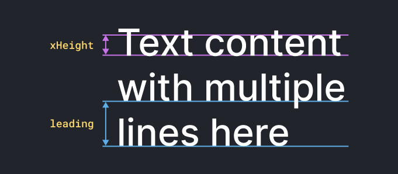
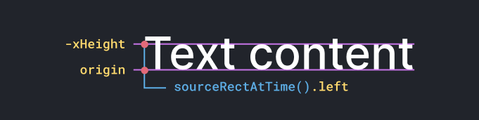

import {
  Note,
  Inform,
  Warn,
  ContentList,
  FileDownload,
} from 'components/callout';
import { Successful, Errorful } from 'components/codeOutput';
import { ToggleSection } from 'components/toggleSection';
import LocalVideo from 'components/localVideo';

<FileDownload fileName="dealing-with-descenders-examples" projectName="Download Project File">

You can download the **After Effects project** for the examples in this post:

</FileDownload>

It's common when creating After Effects templates (such as lower thirds) to set the size of a rectangle based on a text layer. This is so the box will grow to match the size of the layer, no matter the text content.

<Inform>

You do this by linking the size of the box to the width and height of the text layer, with the `js›sourceRectAtTime()` [method](/blog/basics-native-methods) .

</Inform>

## The problem

Linking the box height to the text causes issues as letters with **descenders** (`js›"y, g, j"`) or **ascenders** (`js›"h, f, l"`) will cause the height to fluctuate as the copy changes.

<LocalVideo
  videoName="box-size-from-text-height"
  title="Box height fluctuations when using the text height"
/>

Sometimes this is what the design requires, but in most cases it's preferable to set the rectangle height from the **x-height** rather than the height of the text layer.

<Inform>

**X-height** is the height of flat topped lowercase letters, such as `js›"x"`, `js›"u"` and `js›"z"`.

</Inform>

### Using x-height

Since the x-height is a consistent value across all letters, setting the height of the rectangle **based on the x-height** means the size won't change when the text contains descenders or ascenders.

<LocalVideo
  videoName="box-size-from-cap-height"
  title="Consistent box height when using the cap height, not layer height"
/>

Rather than hard-coding the x-height into the expression you can instead **get the x-height from the text `style` properties**.

## Getting the size

As of After Effects v17, you can now use expressions to access **text style** properties, such as the font, tracking and size.

**The two style properties needed to calculate the height are:**

- `js›fontSize`: used to calculate the x-height, which is the `js›fontSize / 2`
- `js›leading`: the space between baselines



You can destructure these two properties from the `js›style` object:

```js
const { fontSize, leading } = thisLayer.text.sourceText.style;
```

And then use them to get the total height:

```js{2}
const { fontSize, leading } = thisLayer.text.sourceText.style;
const xHeight = fontSize / 2;
const totalHeight = xHeight + leading * (numLines - 1);
```

Here we're using `js›fontSize / 2` to get the height of the first line, and then the `js›leading` to get the height of the remaining lines with `js›leading * (numLines - 1)`.

<Note>

You can use the `js›textCount()` function from our library [aeFunctions](/blog/using-aefunctions) to get the number of lines.

</Note>

Then you can get the layer's width with `js›sourceRectAtTime()`. The complete expression for getting the descender-less size of the text layer is below.

```js
const layer = thisLayer;

const { fontSize, leading } = layer.text.sourceText.style;
const { width } = layer.sourceRectAtTime();

const xHeight = fontSize / 2;
// Getting numLines is omitted for brevity
const height = xHeight + leading * (numLines - 1);

// The descender-less text size
const textSize = [width, height];
```

You then can use this `js›textSize` value to set the size of the box shape layer, while ignoring descenders and ascenders.

## Getting the anchor point

You often need to set the anchor point dynamically as well, so the layer stays in a consistent position as you change the content.

<Inform>

This involves setting the anchor point to the corner of the text, offset by it's size, making sure to set the `js›y` value from the text `js›style` rather than `js›sourceRectAtTime()`.

</Inform>

The anchor point origin for a text layer is at the **baseline of the first line**, so to set the anchor point to the top left you ste each dimension to:

- `js›x`: the left value of `js›sourceRectAtTime`
- `js›y`: `js›-xHeight`, offsetting the default value by the x-height



For example, to center the anchor point to the text layer, ignoring descenders:

```js
const { left } = layer.sourceRectAtTime();
const topLeft = [left, -xHeight];
topLeft + size / 2;
```

## How we use it

To save writing out this code on each text (and box) layer, we've implemented these ideas in expression libraries [aeFunctions](/blog/using-aefunctions) and [eBox](/blog/creating-scaling-rectangles).

<Inform>

Implementing these ideas in libraries avoids duplicating code.

</Inform>

### On the text layer

The [function](/blog/basics-functions) `js›layerRect()` handles getting the descender-less position value, for any corner (or center) of the layer.

```js
// textLayer.transform.anchorPoint
layerRect({ anchor: 'center' }).position;
```

<Note>

`js›layerRect()` automatically gets the descender-less size and position when used on a Text layer.

</Note>

### Box Path

There are two parts to setting the box size (which we do as an expression on a `js›Path` property):

1. Getting the correct `js›width` and `js›height` of the text layer
2. Setting the value for the `js›Path` property

To get the size and position of the text layer without descenders, we use again use`js›layerRect()`. This gives us an object with `js›size` and `js›position` properties which we can use to create the rectangle.

```js
const layer = thisComp.layer('TXT_Copy');
const textRect = layerRect({ layer, anchor: 'center' });
```

We then use the library [eBox](/blog/creating-scaling-rectangles) to create a rectangular path based on the `js›textRect` object.

```js
// Create references to libraries
const { createBox } = footage('eBox.jsx').sourceData;
const { layerRect } = footage('aefunctions.jsx').sourceData.getFunctions();

// Padding around the text
const padding = 36;

// Get the text layer size and position
const textLayer = thisComp.layer('TXT_Copy');
const textRect = aef.layerRect({
  layer: textLayer,
  anchor: 'center',
});

// Create the box path
const myBox = createBox({
  size: add(textRect.size, [padding, padding]),
  position: textRect.position,
  anchor: 'center',
});

myBox.getPath();
```

This expression creates a path that stays centered to the text layer, and matches it size, while ignoring descenders and ascenders automatically.
