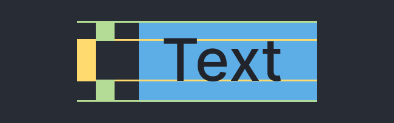

import { Note, Inform, Warn, ContentList, FileDownload } from 'components/callout';
import { Successful, Errorful } from 'components/codeOutput';
import { ToggleSection } from 'components/toggleSection';
import LocalVideo from 'components/localVideo';

<FileDownload fileName="dealing-with-descenders-examples" projectName="Download Project File">

You can download the **After Effects project** for the examples in this post:

</FileDownload>

It's common when creating After Effects templates (such as lower thirds) to set the size of a rectangle based on a text layer. This is so the box will grow to match the size of the layer, no matter the text content.



<Inform>

You do this by basing the width and height of the rectangle on the size of the text layer, plus a padding value, with the either the `js›sourceRectAtTime()` [method](/blog/basics-native-methods) or `js›width` and `js›height` layer [attributes](/blog/basics-native-attributes).

</Inform>

## The problem

Setting the rectangle height from the text height causes issues, as letters with **descenders** (`js›"y, g, j"`) or **ascenders** (`js›"h, f, l"`) will cause the height to fluctuate as the copy changes.

<LocalVideo videoName="box-size-from-text-height" title="Box height fluctuations when using the text height"/>

Sometimes this is what the design requires, but in most cases it's preferable to set the rectangle height from the **cap height** rather than the height of the text layer.

<Inform>

**Cap height** is the height of flat topped capital letters, such as `js›"H"`, `js›"I"` and `js›"X"`.

</Inform>

### Using cap height

Since the cap height is a consistent value across all letters, setting the height of the rectangle **based on the cap height** means the size won't change when the text contains descenders or ascenders.

<LocalVideo videoName="box-size-from-cap-height" title="Consistent box height when using the cap height, not layer height"/>

Rather than writing the cap height value into the expression (which means updating the value on any design changes), you can instead **measure the cap height of the text layer**.

<Note>

Another method of getting a fixed height of a text layer is by **accessing the text style properties** `js›fontSize` and `js›leading`.

Since descenders and ascenders also change the bounding box of a text layer (and thus any positional expressions) we've found the method below more robust.

</Note>

## Replacing lines with "X"

To measure the cap height of the text layer, you need to **measure the height of a letter such as (`js›"X"`)**.

You can do this by replacing the content of your text layer with `js›"X"` in an expression on the `js›sourceText` property.

<Inform>

Doing this on the original text layer insures the `js›"X"` will **match the original text's font properties**, and avoids unnecessary layer duplication.

</Inform>

Since the text may contain multiple lines, you will need to count the number of lines, replacing each one with an `js›"X"`.

```js{7}
// Count the number of line breaks
const numLines = Math.max(
    value.split(/[^\r\n\3]*/gm).length - 1,
    0
  );
// Repeat X for each line
'X\r'.repeat(numLines - 1) + 'X'
```

Now that the text layer contains letters with a consistent height, measuring that height for the height of the text box will give us a consistent value.

**There are two issues which you now need to address:**

- The inaccurate width of the text layer
- You text layer says `js›"X"`, not your text content

You can solve both of these issues using the technique of **hiding values in negative time**.

## Hiding in time

Replacing the lines with `js›"X"` has solved the height issue, but you still need the original text for an accurate width measurement, and to display the correct value.

A technique to access two values on one property (the `js›"X"` version and the original text) is to **store one value in negative time**.

<Inform>

You can reference **two values on the same property** by "storing" one before the start of the composition.

</Inform>

To do this, you change your expression on the text layer so the `js›"X"` version appears before the composition start.

```js
if (time < -500) {
  const numLines = Math.max(
      value.split(/[^\r\n\3]*/gm).length - 1,
      0
    );
  const xText = 'X\r'.repeat(numLines - 1) + 'X'
  xText;
} else {
  value;
}
```

<Note>

You can choose any negative number in place of `js›-500`.

</Note>

Now if you need to access the `js›"X"` text in another expression, you can look at the value **before -500**. For example:

```js
// The width from the current text
const textWidth = textLayer.sourceRectAtTime(time).width;
// The height from the X text
const textHeight = textLayer.sourceRectAtTime(-550).height;
```

Getting the width and height values separately solves any descender or ascender issues, while also maintaining an accurate width measurement.

<LocalVideo videoName="multiple-lines" title="Correct padding with multiple lines"/>

## How we use it

This post covers the general technique of dealing with descenders in templates, rather than the specific expressions needed to set the box size.

To save writing out this large amount of code on each text (and box) layer, we've implemented these ideas in external expression libraries [aeFunctions](/blog/using-aefunctions) and [eBox](/blog/creating-scaling-rectangles).

<Inform>

Implementing these ideas in external libraries avoids duplicating code.

</Inform>

### On the text layer

To hide the `js›"X"` version in negative time, we use the [aeFunction](/blog/using-aefunctions) `js›hideDescenders()`.

```js
const aef = footage('aefunctions.jsx')
  .sourceData
  .getFunctions();

aef.hideDescenders();
```

### Box Path

There are two parts to setting the box size (which we do as an expression on a `js›Path` property):

1. Getting the correct `js›width` and `js›height` of the text layer
2. Setting the value for the `js›Path` property

To get the size and position of the text layer without descenders, we use another [aeFunction](/blog/using-aefunctions) `js›layerRect()`. This gives us an object with `js›size` and `js›position` properties which we can use to create the rectangle.

```js
const aef = footage('aefunctions.jsx')
  .sourceData
  .getFunctions();

const textLayer = thisComp.layer('TXT_Copy');
const textRect = aef.layerRect({
  layer: textLayer,
  anchor: 'center',
  descendersText: true,
});
```

We then use the library [eBox](/blog/creating-scaling-rectangles) to create a rectangular path based on the `js›textRect` object.

```js
// Create references to libraries
const eBox = footage("eBox.jsx").sourceData;
const aef = footage('aefunctions.jsx')
  .sourceData
  .getFunctions();

const padding = 36;

// Get the text layer size and position
const textLayer = thisComp.layer('TXT_Copy');
const textRect = aef.layerRect({
  layer: textLayer,
  anchor: 'center',
  descendersText: true,
});

// Create the box path
const myBox = eBox.createBox({
  size: add(textRect.size, [padding, padding]),
  position: textRect.position,
  anchor: 'center',
});

myBox.getPath();
```

Using [eBox](/blog/creating-scaling-rectangles) allows you to scale this rectangle from any anchor point.