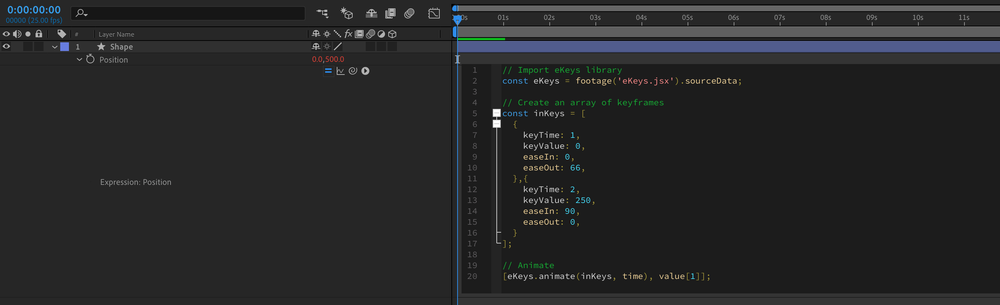
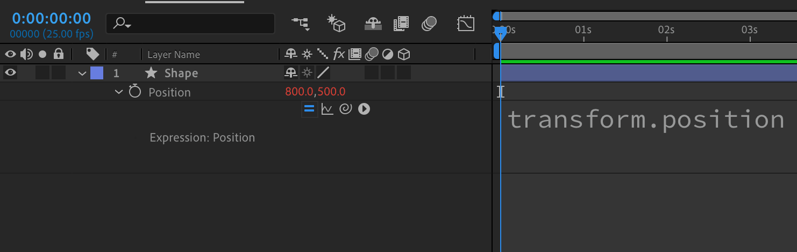

Expressions are hard to learn. You find that perfect bit of code on Creative Cow only to realize it doesn't work in your project. You google your problem to find a confusing answer on Stack Overflow.

This course breaks down expressions into their fundamental components, building a solid foundation that will help you *understand* the code that you write.

By the end of the course you'll have everything you need to be confident solving problems with expressions, no copy pasting needed!

## Course Content

The topics you'll cover are:

- [Variables](../basics-variables)
- [Conditions](../basics-conditions)
- Referencing layers and compositions (coming soon)
- Native attributes (coming soon)
- Loops (coming soon)
- Functions (coming soon)
- Native methods (coming soon)
- Objects (coming soon)
- Arrays (coming soon)

## What are expressions?

In After Effects you can change a layers properties (such as position or opacity) by typing in or dragging the values, adding keyframes to change them over time. This process of changing and animating properties forms the basis of working in After Effects.

What if rather than setting a property manually, you need it to always be the same as another one?

Or you need it to *decide* what value to have based on some else?

This is where expressions come in, as an alternate way of setting the value of properties.

They enable you to combine values together and make automatic decisions about what that property should be.

This alternate way is by writing lines of code, in a language called **JavaScript**, that After Effects will run. The result of this code is then set as the value of the property.

> Expressions are lines of computer code that After Effects runs every frame to generate the value of a property.

## How to add an expression

You can add an expression to a property in After Effects by:

- Holding <kbd>alt</kbd> while clicking on the properties stop watch (the icon next to it's name)
- Using the 'Add Expression' shortcut <kbd>alt</kbd> + <kbd>shift</kbd> + <kbd>=</kbd> with the property selected
- Clicking <kbd>Add Expression</kbd> in the <kbd>Animation</kbd> menu

These will add a new expression with some placeholder code to the property.

This placeholder references the **before expression value**, that is the value of the property without any expression applied. This means you can continue to modify and animate the property as if no expression was applied.

## Setting the value

The statement completion value of the entire expression.

The last line that has a completion value of (`!empty`).

[https://github.com/getify/You-Dont-Know-JS/blob/9959fc904d584bbf0b02cf41c192f74ff4238581/types-grammar/ch5.md#statements--expressions]

[https://developer.mozilla.org/en-US/docs/Web/JavaScript/Reference/Global_Objects/eval]

[https://www.mattzeunert.com/2017/01/10/whats-a-statement-completion-value-in-javascript.html]

[https://www.ecma-international.org/ecma-262/6.0/#sec-block-runtime-semantics-evaluation]