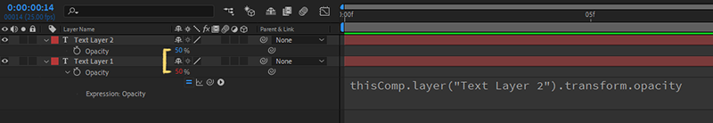

import { Note, Inform, Warn } from 'components/callout';
import ContentList from 'components/contentList';

In previous article you've learnt how to create and use [variables](/blog/basics-variables) in your expressions. This let you reference pieces of data in your expression using a variable name, for example:

```js
const myVar = 'Hello';
```

Often you need to that value to come from a property on a different layer, rather than typing it into the expression directly. This allows you to 'link' layers together, one of the main uses for expressions.

```js
const myVar = 'some value on another layer?';
```

In this article you'll learn how to access properties on other layers in expressions, as well as layers in other compositions.

<ContentList>

- [Using the Pick Whip](#using-the-pick-whip)
- [Referencing Layers](#referencing-layers)
- [Referencing Compositions](#referencing-compositions)
- [Referencing Attributes](referencing-attributes)

</ContentList>

## Using the Pick Whip

One way to add a reference to a property on another layer is by using the **pick whip**.

This will let you select a property to reference using the After Effects interface, adding code to your expression that references the property.


<Inform>

The pick whip is a visual way of adding references to other properties in an expression.

</Inform>

In the above example we've used the pick whip to 'link' the opacity of two text layers by:

1. Adding an expression to the opacity of 'Text Layer 1'
2. Dragging from the pick whip icon (the swirl) to the property we wish to reference.

After Effects then inserted the following code into the expression on `js›'Text Layer 1'`:

```js
thisComp.layer("Text Layer 2").transform.opacity
```

If you then change the Opacity of `js›'Text Layer 1'` you can see the Opacity of `js›'Text Layer 2'` update to match.



In the rest of this article, you'll learn how this expression works as well as how to write it yourself.

## Referencing Compositions

```js
const otherComp = comp('Comp Name' || compIndex);
```

A variable that will always be the current comp.

```js
thisComp;
```

## Referencing Layers

```js
const otherLayer = otherComp.layer('layerName');
```

```js
thisLayer;
```

## Layer Attributes

```js
thisLayer.transform.opacity;
```

```js
thisProperty;
```

```js
value;
```
