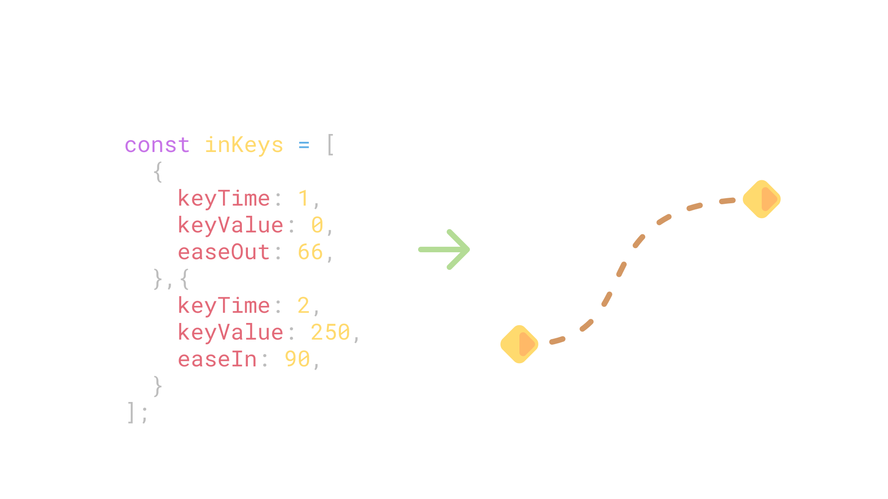
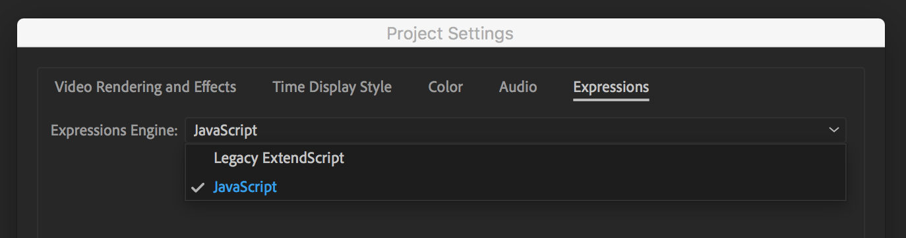
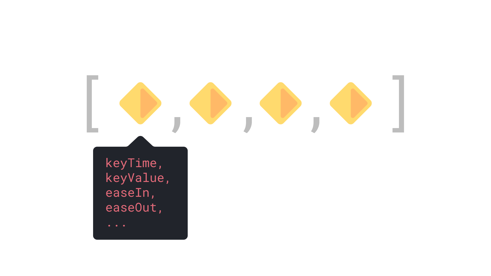

[GithubPage]: https://github.com/motiondeveloper/eKeys

When making [Motion Graphics Templates](https://helpx.adobe.com/au/after-effects/using/creating-motion-graphics-templates.html) in After Effects, or any other type of automated work, there comes a time when you wish you were able to add and modify keyframes with expressions.

While you're able to get some functionality using the `linear` or `ease` expressions, this quickly gets messy, and you're still not able to modify the easing like you are with keyframes.

**eKeys** solves this problem by giving you an easy way to create keyframes in expressions. In this blog post, you'll learn how to get starting using eKeys in your projects.

- [What is eKeys](#what-is-ekeys)
- [Installation](#installation)
  - [Compatibility](#compatibility)
- [Writing the expression](#writing-the-expression)
  - [The Keyframe Array](#the-keyframe-array)
  - [Returning the final animation](#returning-the-final-animation)
- [Why use eKeys](#why-use-ekeys)
- [What's next](#whats-next)

## What is eKeys

eKeys is an importable animation engine for After Effects that allows you to animate within expressions, with the same level of control as traditional keyframes.

It comes in the form of a `.jsx` file that's imported into your project, with the properties for each keyframe added/modified within the expression.



## Installation

You can download the latest version of eKeys from the [GitHub Releases page](https://github.com/motiondeveloper/eKeys/releases). You can also find some more detailed information [more detailed information][GithubPage] there on using eKeys.

Once downloaded, all you need to do is import the file into your After Effects project like you would any other footage item.

> ⚠️ Since After Effects doesn't count footage items that are only referenced within expressions as used, it's recommended that you also place the eKeys.jsx file in any compositions where it is referenced.
>
> This will ensure After Effects includes the file when collecting assets or packaging into a Motion Graphics Template

### Compatibility

eKeys is only compatible with the new [JavaScript](https://helpx.adobe.com/after-effects/using/expression-language-reference.html) engine available in CC2019.

You can make sure that your project is using the JavaScript engine by going to `File > Project Settings > Expressions` and setting the Expressions Engine to JavaScript.



If you're using an older version of After Effects, you can use an [old version of eKeys](https://github.com/motiondeveloper/ekeys/tree/extendscript) that's compatible.

## Writing the expression

To start using eKeys in an expression, you first need to create a reference to the file we imported earlier.

```js
const eKeys = footage('eKeys.jsx').sourceData;
```

Then we can create our keyframe objects.

### The Keyframe Array

eKeys represents each keyframe as an object in an array, with properties that define how to animate.



Below is two example keyframes that will animate a position property over two seconds.

```js
const eKeys = footage('eKeys.jsx').sourceData;
const keys = [
    {
        keyTime: 1,
        keyValue: [100, 540],
        easeOut: 90,
    },{
        keyTime: 2,
        keyValue: [800, 540],
        easeIn: 100,
    }
];
```

> eKeys expects each keyframe to have a `keyTime` and `keyValue` property, while all the other properties are optional.

#### The format of each of these properties is

- **`keyTime`**

    The location of the keyframe on the timeline, in seconds

- **`keyValue`**

    The value of the keyframe, which can be a number or array

- **`easeIn`** and **`easeOut`**

    The amount of easing to be applied as a number between 0 and 100 (both defaulting to 33).

    This works the same way as the influence percentage you might be used to seeing on traditional keyframes.

- **`velocityIn`** and **`velocityOut`**

    The incoming and outgoing velocity of the keyframe (both defaulting to 0).

You can find more information on these properties on the [Github Page][GithubPage].

> eKeys sorts the keyframes by their time before animating, so you don't have to put them in the right order - but your expressions will be a lot clearer if you do!

### Returning the final animation

You can now get the final animated value by calling the `animate()` function, and passing it your keyframe array and a time value.

```js{14}
const eKeys = footage('eKeys.jsx').sourceData;
const keys = [
    {
        keyTime: 1,
        keyValue: [100, 540],
        easeOut: 90,
    },{
        keyTime: 2,
        keyValue: [800, 540],
        easeIn: 100,
    }
];

eKeys.animate(keys, time);
```

You can call `eKeys.animate()` with with any number to return the animated value at that time. This allows you to get the value at a specific time, reverse the animation, or play the animation at different speeds.

Passing the composition time, as `time`, will give you the animation as normal.

## Why use eKeys

While the example in this post would have been much easier to create with traditional keyframes, the real benefit of eKeys comes when using JavaScript to set the keyframe properties dynamically.

eKeys simplifies tasks such as:

- Creating dynamic templates that respond to user input
- Animating between wiggles or parents with easing
- Creating After Effects tools and presets

Being able to create keyframes with JavaScript also has the benefits of being able to create and modify the keyframe array programmatically.

One example of this is setting default parameters with the spread syntax.

```js{11}
const keyDefaults = {
    easeOut: 80,
    easeIn: 100,
    velocityOut: 40,
}

const keys = [
    {
        keyTime: 1,
        keyValue: someValue,
        ...keyDefaults,
    },
];
```

## What's next

There are a couple of major updates that will be coming to eKeys sometime in the future:

- Extra animation methods such as spring and hold keyframes
- Input easing as a `cubicBezier` list, similar to CSS

If you have any ideas on how to improve eKeys or any other feedback, feel free to reach out to us on Twitter, [@modeveloper](https://twitter.com/modeveloper).
