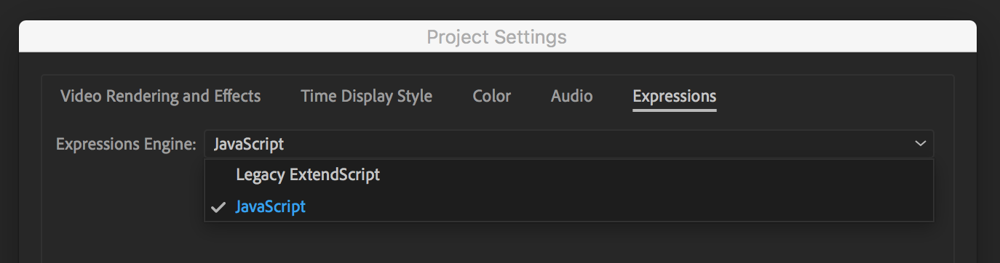

import { Note, Inform, Warn, ContentList } from 'components/callout';

With the release of After Effects version 16 (October 15, 2018), a new engine for running expressions was added, called the **JavaScript** engine.

<Inform>

The **JavaScript engine** is available in After Effects CC2019 and later.

</Inform>

Previous versions of After Effects used the **ExtendScript** engine, which ran code written in a  version of JavaScript released in 1999, known as ECMAScript 3.

JavaScript is an evolving language, with features added since 1999 that greatly improve the coding experience. These new features aren't available in the **ExtendScript** engine, as it can only interpret the older version of the language.

## Setting the engine of your project

You can make sure that your project is using the JavaScript engine by going to <kbd>File</kbd> > <kbd>Project Settings</kbd> > <kbd>Expressions</kbd> and setting the `js›Expressions Engine` to `js›JavaScript`.

## Differences in the JavaScript engine

When you set your project to the **JavaScript Engine**, your expressions pre-processed by After Effects, then executed using third party tools that can interpret all the modern features built into the language.

The tool used depends on your operating system:

- **On macOS**: Apple's [JavaScriptCore](https://developer.apple.com/documentation/javascriptcore) framework
- **On Windows**: Google's open source [V8 Engine](https://v8.dev/)

These tools are updated to match the new features added into the [ECMAScript Specification](https://tc39.es/ecma262/2020/), as they are approved by the governing committee TC39.

Some of the new features available in modern versions of JavaScript include:

- `js›let` and `js›const` [variable](/blog/basics-variables) declarations
- Array [methods](/blog/basics-native-methods) such as `js›filter()`, `js›map()` and `js›reduce()`
- [Object](/blog/basics-objects) rest and spread
- Arrow [functions](/blog/basics-functions)

<Note>

For a list of differences between using the JavaScript and ExtendScript engines, see [this article from Adobe](https://helpx.adobe.com/after-effects/using/legacy-and-extend-script-engine.html)

</Note>

## Why we use the JavaScript engine

The expressions on Motion Developer are all built to run in the JavaScript engine, and they will not work in the ExtendScript engine.

This is due to the features available in modern versions of JavaScript making writing expressions faster, more powerful, and more enjoyable.

We believe learning to write expressions with these new features is worthwhile, and teaching After Effects users modern JavaScript is a large part of what we do.

<Inform>

To learn the basics of writing expressions in the JavaScript engine, see our [Expression Basics course](/blog/basics-introduction).

</Inform>