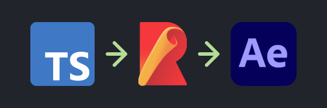
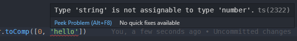
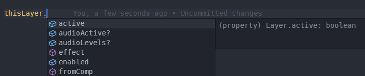

import {
  Note,
  Inform,
  Warn,
  ContentList,
  FileDownload,
} from 'components/callout';
import { Successful, Errorful } from 'components/codeOutput';
import { ToggleSection } from 'components/toggleSection';
import LocalVideo from 'components/localVideo';

In this article we'll go over how to write expressions libraries (`js›.jsx`) files in [TypeScript](https://www.typescriptlang.org/), with automatic refresh, using [Rollup.js](https://rollupjs.org/guide/en/).



This means you can write expressions with the full benefits of:

- Type checking

  

- Auto-completion

  

All while working in working in [VS Code](http://code.visualstudio.com), that will re-compile and update in After Effects on save.

<Note>

**This article assumes you're familiar with tools such  as Git, GitHub, NPM.**

If you're not sure what these are, feel free to read on but you may encounter issues.

</Note>

## Quick setup

The easiest way to get started is by using out **template repository** on GitHub: [Expressions Library Template (GitHub)](https://github.com/motiondeveloper/expressions-library-template)

1. **Create a new repository from the template *(optional)***

  You can click the "Use this template" button on the GitHub repo to create a new repository on your GitHub profile with this template.

2. **Clone the repo locally**

  ```sh
  git clone https://github.com/motiondeveloper/expressions-library-template.git
  ```

  *If you created a new repo from the template, the URL would be the new repo you created.*

2. **Install the dependencies**

  Navigate into the directory:

  ```sh
  cd expressions-library-template
  ```

  And install the NPM dependencies:

  ```sh
  npm install
  ```

3. **Edit the `sh›/src` files**

  Any code in the `sh›src/index.ts` file will be output to `sh›dist/index.jsx` as After Effects compatible `js›.jsx` files.

4. **Run rollup in watch mode**

  ```sh
  npm run watch
  ```

  This will re-compile your files into After Effects compatible `js›.jsx` files every time you save.

5. **Import the file into After Effects**

  You can then import the output `js›.jsx` file into After Effects, and use it in your expressions, for example.

  ```js
  const libraryCode = footage('index.jsx').sourceData;
  libraryCode.someFunction();
  ```

  After Effects will reload the `js›.jsx` file when it's recompiled, so you'll see the result of your code every time you save your source file.


## Using the After Effects API

Since you're writing expressions outside of After Effects, [native attributes](/blog/basics-native-attributes) and [native methods](/blog/basics-native-methods) such as `js›thisComp`, `js›linear` and `js›wiggle` aren't defined when you're writing the code.

<Inform>

To add type safety and auto completion for After Effects variables and functions, this setup uses the package [expression-globals-typescript](https://github.com/motiondeveloper/expression-globals-typescript).

</Inform>

This package mocks the After Effects API in TypeScript, so you can write expressions outside of an After Effects environment.

### Classes

To create layers, compositions and properties, you can use the classes exported from the library. For example:

```ts
import { Comp, Layer } from 'expression-globals-typescript';
const thisComp = new Comp();
const thisLayer = new Layer();
```

To create properties (such as position or scale), you can use the `js›Property` class.

```ts
import { Property, Vector } from 'expression-globals-typescript';
const thisProperty = new Property<Vector>([0, 100]);
```

The `js›Property` constructor takes a value to set as the property value, and a type (`js›<>`) to set as the type for the property.

### Global Functions and Variables

You can import any global functions available in expressions, fully typed, from the same package:

```ts
import { time, linear } from 'expression-globals-typescript';
linear(time, 0, 1, 5, 200);
```

*VS Code should prompt you to auto import these when you reference them.*

### After Effects Types

You can import After Effect's specific types such as `Color` and `Vector` from the package to properly type your expressions.

<Inform>

To see all the Types and Base Objects available, see the [expression-globals-typescript](https://github.com/motiondeveloper/expression-globals-typescript) source code.

</Inform>

## How it works

1. [expression-globals-typescript](https://github.com/motiondeveloper/expression-globals-typescript) allows you to use the Expressions API outside of After Effects
2. [Rollup.js](https://rollupjs.org/guide/en/) watches the source files, and runs the [TypeScript](https://www.typescriptlang.org/) compiler as well as:
3. [rollup-plugin-ae-jsx](https://github.com/motiondeveloper/rollup-plugin-ae-jsx) Transforms the output code into After Effects compatible JSON (`js›.jsx`) files


## Creating releases

To distribute the output (`js›.jsx`) file via GitHub releases, you can run the `js›release` command:

```sh
npm run release
```

This will create a new release on GitHub using [Hub](https://github.com/github/hub), opening an editor in your terminal to add the release title and body.

**There's two settings in your `sh›package.json` that affect the release:**

- The release version comes from the `sh›"version"`
- You can set which file to attach to the release in the `sh›release` script, which is `sh›dist/index.jsx` by default